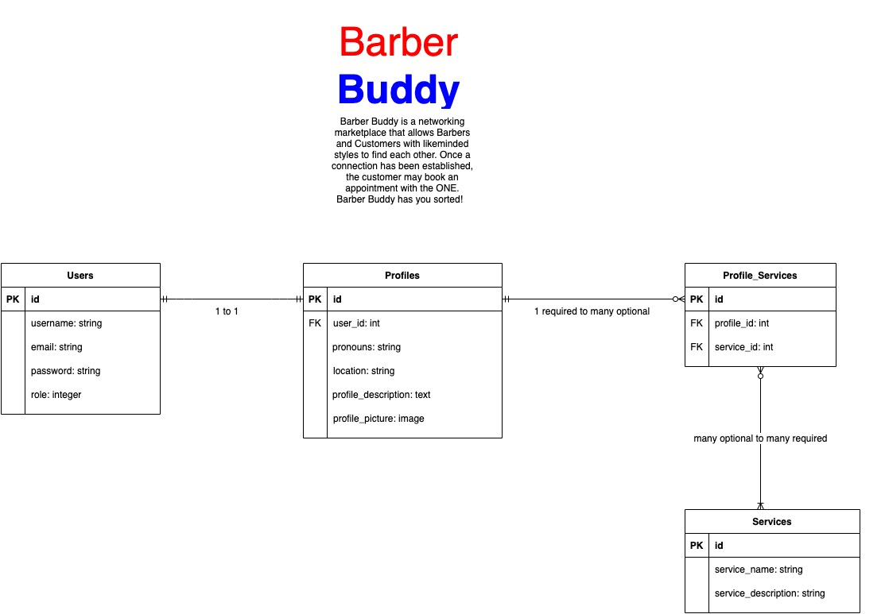

##### By Karla Tolentino
# T2A2 - "Barber Buddy" Marketplace Project

## Table of Contents
- [App Deployment](#app-deployment)
- [GitHub Repository](#github-repository)
- [Purpose and Target Audience](#purpose-and-target-audience)
- [Functionality and Features](#functionality-and-features)
- [Sitemap](#sitemap)
- [Screenshots](#screenshots)
- [Target Audience](#target-audience)
- [Tech Stack](#tech-stack)
- [User Stories](#user-stories)
- [Wireframes](#wireframes)
- [ERD](#erd)
- [Abstractions](#abstractions)
- [Third Party Services](#third-party-services)
- [Project Models, Database Relations and Schema Design](#project-models-and-database-relations)
- [Project Management](#project-management)

## App Deployment
https://barber-buddy.herokuapp.com/

## GitHub Repository
https://github.com/karlatolentino/Barber-Buddy

## Purpose and Target Audience
*Barber Buddy* is a networking marketplace application created for Barbers and Barber clients to find each other. As the creator of this application is a barber by trade, this concept was curated with the barber and client's direction in mind.

The *purpose* of this app is to help both the Barber and their Buddy establish a mutual connection with each other before they even enter the shop and sit in the chair for their haircut appointment. A common *problem* within the hairdressing industry is the amount of trial and error required for a client to find a hairdresser or barber that not only understands their needs, but also enjoy their conversations.

Having the right vibe and conversations between the Barber and Buddy can make or break a client's experience within the barbershop, and affect a Barber's clientele retention and reputation. If a client or Buddy is satisfied with the quality of the cut, their experience may be dampened with conflicting interests with the Barber that is often discovered during their appointment. As barbering is a highly transportable skill, many Barbers tend to not stay in the same place for a long time. This can prove to be quite frustrating for clients who have finally found the right barber and must restart the process of searching for a new barber who can fill their criteria needs.

*Barber Buddy* aims to showcase the needs of both Barber and Buddy/clients in an informal manner. This networking application enables both parties to seek out relationships that are genuine by matching each other by their similar needs and interests. For example, if a Barber is looking to experiment with unconventional hairstyles, they may include that information on their profile when seeking for a Buddy. If a Buddy is looking for a Barber with a specific skill or specialisation, they may also include that information on their profile. A Barber or Buddy may even just describe their topic interests if all they require for a great haircut experience is great banter. Once both parties have created their profile on *Barber Buddy*, they can then begin the search for the perfect connection.

The *target audience* for this application is directed towards users who are either Barbers or clients who seek out each other for a haircut. The majority of clients who visit barbershops usually rely on external resources to find the right barber.  Often times, clients switch between different hairdressers or barbers and can have different expectations of what the client's needs are. By creating this app, bridging the communication gap between barber and client can increase client satisfaction and boost the overall experience at the shop. *Barber Buddy* offers a safe networking space Barbers and Buddies to create positive relationships by addressing their criteria needs for the perfect haircut experience.

## Functionality and Features
* **1. Landing Page**

Upon launching the app, the user will be taken to the *Barber Buddy* landing home page. From there, they are able to access and view the About page to discover the purpose of the app and what they are able to offer to users. In order to view *Barber Buddy* profiles, they must log in or be a registered user.

* **2. User Registration**

If a user accesses the Register page from the navigation bar, or any other page apart from the About page, they are taken to the user registration page. From here, they must input an email address, username, password and password confirmation and specifiy whether they are a Barber or a Buddy. Upon completion of the registration form, they are taken back to the home page where they can have full access to Barber Buddy profiles and create their own.

* **3. User Log in**

If prompted to log in, a user is directed to input their email address and password. Upon successful log in, they will be taken to the *Barber Buddy* home page. If they have forgotten their password, there is an action button below the log in form that enables the user to send a password reset form to their chosen email address. If the user is not registered, there is a sign up action button that will redirect them to the user registration page.

* **4. User Account**

Once a user has registered and logged in, they are able to access the Account page. From there, they are allowed to change their user password and/or delete their account. Once their account is deleted, they must register again for full access of the app.

* **5. Create a Profile**

Once a user has registered an account on *Barber Buddy*, they are able to create their own Barber or Buddy profile on either the Profile page or Barber and Buddies page. From here, they must fill out a form that takes in the users details:
- First Name
- Last Name
- Pronouns
- Location: specified by suburb and state
- About Me: a section for the user to describe their personality and interests. They may also outline their specialisations and desires, if any.
- Services offered/desired: user can check off any services provided by *Barber Buddy* that are relevant to the user
- Profile Picture upload: user is able to upload one image as their profile picture

* **6. Edit/Update Profile**

Once a user is registered, they are able to edit their profile via the Profile or Barbers and Buddies page. The same form from the Create a Profle page is rendered for the user.

* **7. Profile Index and Views / Barbers and Buddies**

Once a user is registered, they are able to access the Barbers and Buddies page where a list of user profiles are shown. From there, they are able to view the selected profiles to display that users profile information. If the profile selected is, it will display  that user's profile image, name, pronouns, location and show whether they are either a Barber or a Buddy. Below their About Me section, it will list the services that are desired/offered by that user. The registered user will only be allowed to edit and delete their profile on either the Barber and Buddies page or their Profile page. If the user finds the perfect profile match, they are able to contact that match via a contact button that opens up their mail app and inputs the chosen user profile's email address and establish a conversation.

* **7. Search Filter**

On the Barbers and Buddies index page, users are able to search for text that matches a user profile's description via a search form. For example, if a user types in 'music' in the search bar and hits the search button, it will list the profiles that match the query in their About Me desription. This will enable Barbers and Buddies to identify specific profiles of their liking.

## Sitemap

## Screenshots

View more screenshots [here](docs/screenshots)

## Tech Stack
This application has been created using HTML, CSS, SCSS, Javascript and Ruby on Rails. This app is deployed on Heroku and GitHub.

## User Stories
As a Barber, I want to find more clients who are willing to try new and unique hairstyles with me so I can maintain a specific client base to showcase on my haircut portfolio.

As a Barber Client, I want to find a barber who specialises in hair art so I can display my eccentric style and personality.

As a Barber, I want to find more clients who want to talk openly about art and music so we can share mutual topics of conversation in our appointments.

As a Barber Client, I want to find a barber who understands me on a personal level and have a good relationship with while I get my haircut so I feel more comfortable in the shop.

As a Barber, I want to find and contact clients with a specific style to utilise them as my model in my hair exhibition shows and demonstrations.

As a Barber Client, I want a barber who is real and honest with me about my haircut expectations and is willing to suggest something cool to try out.

As an Apprentice Barber, I want to find clients with facial hair to help me practice my shaving and beard trimming skills.

As a Barber Client, I want to find a barber who specialises in how to cut and style curly hair as there are not many barbers in my area who can do this.

As an Apprentice Barber, I seek out clients who are willing to come in for hair colouring services to  improve my hair colouring skills and process.

As a Barber Client, I want to find a Barber who is down-to-earth and easily approachable in consultations so I feel comfortable discussing my needs. I have previously never enjoyed going to the barbershop growing up as I felt intimidated, but now with *Barber Buddy* I can seek out the right Barber for me.

As a Barbershop owner, I want to promote healthy and positive topics of conversations between my barbers and their clients by attracting a specific demographic of people into my shop.

## Wireframes
View Wireframes [here](docs/barber-buddy-wireframes.pdf)

## ERD

## Abstractions
The high level components used in this application include the following:

- Active Model: Model View Controller has an Active Model that represents the model interface. Ruby classes can be defined as a model and is significant in writing unique layers to persist in the database and into Rails.

- Active Record: it is the Object Relational Mapping element of Rails. In order to maintain DRY (Don't Repeat Yourself) and clean code, it follows naming and convention in order to define the classes that are persisted in the database tables.

- Action Pack: This acts as part of the Rails Model View Controller behaviour that carries out request, routing, handling and generating the view for the Web. In order to give back a response, it defines controllers that performs actions to render views.

- Active Storage: facilitates the uploading of files to a cloud storage services. In this app, users are able to upload a profile picture onto their profile and are able to do so due to Amazon S3. Amazon S3 is the cloud storage service used to handle user data and attaches pictures to the Active Record objects. It is included in local disk-based service for testing, development and production.

- Active Support: holds a compilation of standard library extensions and utility classes that are convenient and used conventionally in Rails.

- Active Resource: Links together Representational State Transfer (REST) and business objects that are used to reveal ActiveRecord models with minimal code. Active Resource is efficient in creating APIs.

## Third Party Services
There are two main *third party services* that *Barber Buddy* utlises:

1. Heroku PaaS (Platform as a Service):

*Barber Buddy* is deployed on Heroku.

Heroku is a cloud platform as a service that supports many different programming languages and assists developers in developing, running, and scaling applications. Applications that run on Heroku have a unique domain name that is utilised to route HTTP requests to the right application controller called "dyno". Individual dynos are spread across a dyno grid that holds many servers. Heroku's Git server manages application repo pushes from permitted users. Amazon's EC2 cloud computing platform hosts all Heroku services.

2. Amazon s3 IaaS (Infrastructure as a Service):

*Barber Buddy* implements an image uploading feature on it's user profile page. These images are stored on Amazon s3 for the internet.

Amazon Simple Storage Service (Amazon s3) is designed to simplify internet computing. It is used to collect and store data anywhere and anytime on the internet. Developers are allowed access to identical data storage infrastructure that is used by Amazon that is highly scalable, fast and reliable. Amazon s3 have buckets that are containers for objects stored on its service, and is used to identify accounts responsible for data and storage transfer charges. These objects have a key and value pair and a version ID and are also used for access control. A region is specified for for where the bucket created by Amazon s3 will be stored, and is chosen based on optimal latency, minimal costs or regulatory address requirements.

## Project Models and Database Relations 

In my application, there are four models that are used: Users, Profiles, Profile Services, and Services.

For every User of the app, they are required to register with an email address, username, password and role (barber or buddy).

A Profile model belongs to/has one User, and a User has one Profile.

The Profile model references the User model and collects the user's pronouns, location, profile description and profile image.

The Service model is joint with the Users model through a joint table called Profile Services, where a user Profile has many optional Profile Services, and Profile Services belongs to a user Profile.

The Services model stores the service name and description that populates the app.

### Database Schema Design

- Users Model
   - ID (PK)
   - username :string
   - email :string
   - password :string
   - role :integer
- Profiles Model
   - (Foreign Key) user_id :integer
   - pronouns :string
   - location :string
   - profile_desription :text
   - profile_picture :picture:attached
- Profile Services Model
   - (Foreign Key) profile_id :integer
   - (Foreign Key) service_id :integer
- Services Model
   - service_name :string
   - service_description :string

## Project Management

Trello has been used as the the primary project management system, where application tasks are split between phases: to do, pending, blocked and done. Prioritised tasks are to be completed first and the rest are worked through as necessary. Each task has multiple checklists and a timeframe for completion. As each task checklist is completed, the complete task is then shifted to "done".

See below the project management process:

